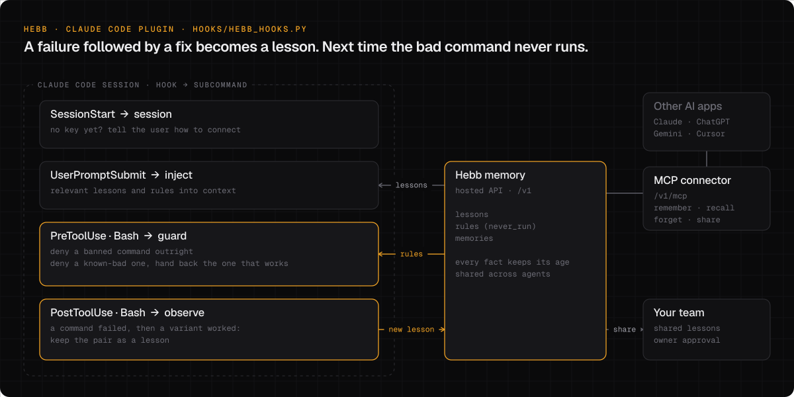
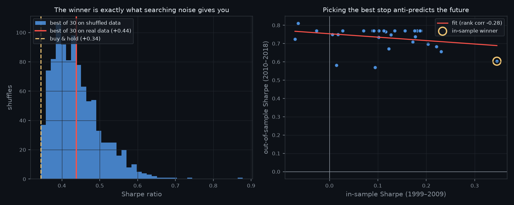
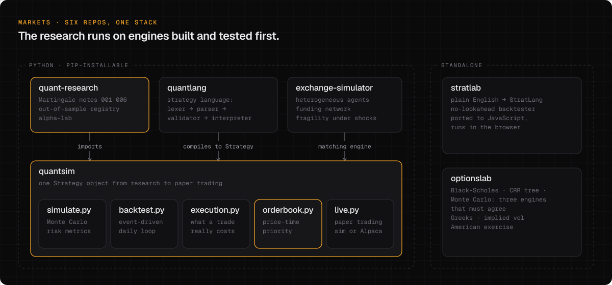
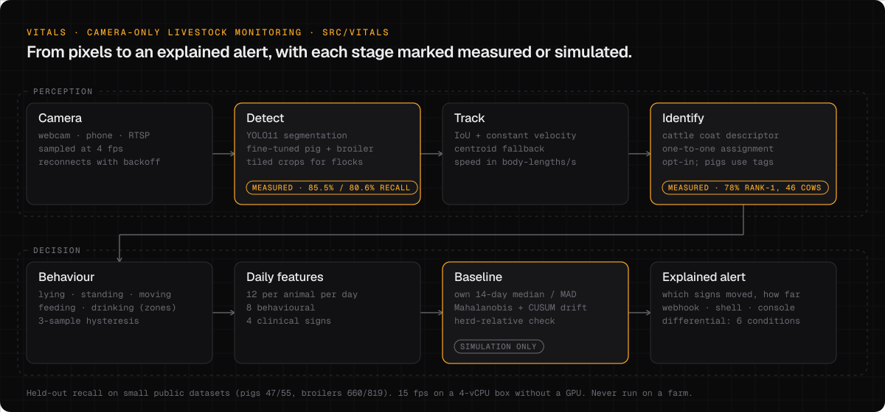

<picture>
  <source media="(prefers-color-scheme: dark)" srcset="assets/banner-dark.svg">
  <source media="(prefers-color-scheme: light)" srcset="assets/banner-light.svg">
  
</picture>

  <a href="#hebb"><b>HEBB</b></a> &nbsp;·&nbsp;
  <a href="#markets"><b>Markets</b></a> &nbsp;·&nbsp;
  <a href="#vision"><b>Vision</b></a> &nbsp;·&nbsp;
  <a href="#robotics"><b>Robotics</b></a> &nbsp;·&nbsp;
  <a href="#products"><b>Products</b></a> &nbsp;·&nbsp;
  <a href="#engineering"><b>Engineering</b></a> &nbsp;·&nbsp;
  <a href="#activity"><b>Activity</b></a>

I learn a field by building the machinery underneath it, then pointing it at a question I don't trust the popular answer to. Can a coding agent stop repeating the same mistake? Does a stop-loss actually improve returns? Can an ordinary camera tell that an animal is off before a person does?

Right now that means **[HEBB](#hebb)**, a learning layer for AI agents; **[Martingale](#markets)**, a lab that tests trading claims against null models; and **[Vitals](#vision)**, livestock monitoring from ordinary cameras with no sensor on the animal.

 

## HEBB

**AI is trained. HEBB makes it learn.**

Coding agents start every session from zero. Claude Code runs `python`, finds out the machine only has `python3`, and makes the same mistake tomorrow. HEBB keeps what an agent found out, puts it back in front of the agent when it matters, and shares it across sessions, tools and teammates.

<picture>
  <source media="(prefers-color-scheme: dark)" srcset="assets/hebb-loop-dark.svg">
  <source media="(prefers-color-scheme: light)" srcset="assets/hebb-loop-light.svg">
  
</picture>

|  |  |
|:--|:--|
| **Built** | A Claude Code plugin (four hooks, standard-library Python) and a hosted memory API with an MCP connector. A failed command followed by one that works becomes a lesson. Known-bad commands are denied before they run, and Claude is handed the command that works. A ban like "never `terraform destroy`" becomes a hard block, not a suggestion. |
| **Evidence** | Early pilot reported in the plugin README: 112 Claude Code sessions on simulated machines, plugin v0.3, one model. **81% fewer failed commands**, 31% fewer agent turns, 33% fewer tokens. A larger study is next. |
| **Status** | Plugin `v0.4.1`, public and installable. Memory service in active development. |
| **Stack** | `Python` `Claude Code hooks` `MCP over HTTP` `Cloudflare Pages` |

**[hebb-claude-plugin →](https://github.com/NeilGilani/hebb-claude-plugin)** &nbsp;·&nbsp; [hebb-site.pages.dev](https://hebb-site.pages.dev)

 

## Markets

### Martingale: trading claims, tested against a null

Most trading repos claim to have found an edge. This one checks whether the edge survives a null model. The standard: state the hypothesis before running anything, no lookahead, hold out data the search never touched, charge costs, and publish the answer even when it's no. Notes 005 and 006 meet all of it and regenerate every number byte-for-byte from one script.

Note 006. The best stop rule on real data (red) is what searching shuffled, trendless data produces anyway. Picking it on 1999–2009 then anti-predicts 2010–2018.

| # | Question | Finding |
|:--:|:--|:--|
| 001 | How much do backtests overstate performance? | A one-line lookahead bug adds **+1.12** Sharpe. The best of 337 strategies on random data shows **0.77** in-sample and **−0.54** out-of-sample. |
| 005 | Where do index returns actually come from? | The NASDAQ Composite's whole 1999–2018 gain came overnight (**+917%**) while the intraday session lost 70%. Break-even cost to trade it: **2.46 bp** per side. A widely used S&P 500 feed gives the reversed answer because its opens are stale. |
| 006 | Do stop-losses improve risk-adjusted returns? | The best of 30 stop rules beats buy-and-hold by **+0.094** Sharpe. The same search on shuffled bars beats it by **+0.095** (*p* = 0.43). The in-sample winner then loses **−0.166** out-of-sample. |

<!--DIGEST:START-->
> **Latest note · 006** — Do stop-losses actually improve risk-adjusted returns?
> Across 5,031 days of the NASDAQ Composite, the edge is the search: the best of 30 stop rules beats buy-and-hold by +0.094 Sharpe, and the same search on shuffled bars with every trend destroyed beats it by +0.095 (p = 0.43). Picking the winner on history then loses −0.166 forward, and in-sample rank anti-predicts out-of-sample (−0.28). Real findings: 20.6% of stops gap through their price. [Read the paper →](https://github.com/NeilGilani/quant-research)
>
> **In progress · 007** — How much history do you need to tell skill from luck?
<!--DIGEST:END-->

**[All notes, papers and code →](https://github.com/NeilGilani/quant-research)** &nbsp;·&nbsp; [out-of-sample registry](https://github.com/NeilGilani/quant-research/tree/main/registry) &nbsp;·&nbsp; [methodology](https://github.com/NeilGilani/quant-research/blob/main/METHODOLOGY.md)

### The stack under the research

<picture>
  <source media="(prefers-color-scheme: dark)" srcset="assets/markets-stack-dark.svg">
  <source media="(prefers-color-scheme: light)" srcset="assets/markets-stack-light.svg">
  
</picture>

| Repo | What it is | The part worth reading |
|:--|:--|:--|
| [quantsim](https://github.com/NeilGilani/quantsim) | Backtester, order book, Monte Carlo risk, paper trading | The same `Strategy` object runs in the backtester and the paper-trading loop, so nothing is rewritten between what was tested and what would trade. 44 tests, and an order-book benchmark above 150k orders/sec. |
| [exchange-simulator](https://github.com/NeilGilani/exchange-simulator) | Agent-based market on quantsim's matching engine | Dealers, levered funds, market makers and pension funds trade on a funding network. The README opens by explaining why it *can't* predict crashes, and measures fragility instead. |
| [optionslab](https://github.com/NeilGilani/optionslab) | Option pricing | Black–Scholes, a CRR tree and Monte Carlo share no code, and the test suite requires them to agree within tolerance across a parameter grid. |
| [quantlang](https://github.com/NeilGilani/quantlang) | A small language for trading strategies | Hand-written lexer, recursive-descent parser, validator and interpreter. The compiler refuses strategies with undefined behavior. |
| [stratlab](https://github.com/NeilGilani/stratlab) | Backtesting in the browser | Plain English to StratLang to an equity curve, entirely client-side, with costs on and buy-and-hold as the benchmark. |

### Also in markets

**BrainStock** private · with [@Kickedmixus](https://github.com/Kickedmixus) 
An experiment in systematic forecasting and model evaluation. A 1D CNN reads a 120-candle window across 25 liquid US tickers and predicts return and direction at three horizons. Splits are strictly chronological, and a retrained model replaces the current one only if its composite score (accuracy, loss, clamped Sharpe and profit factor, drawdown) is higher on held-out data with 10 bp fees. `PyTorch` `DuckDB` `pandas`

**YN Finance** January 2026 
Where I started: a Bloomberg-style research terminal built in a 15-day, 375-commit sprint. Streamlit, yfinance, and Plotly and TradingView charts across statements, options open interest, analyst targets, RSI/MACD and Monte Carlo pages, plus Gemini summaries and a paper-trading page. It was a prototype for breadth. Everything above came after it: fewer screens, more checking.

 

## Vision

### Vitals: livestock health from ordinary cameras

private repo · research prototype

Animals hide illness from people, and nobody can watch a barn all night. Vitals segments and tracks animals from an ordinary camera stream, turns their geometry into behavior, builds each animal's own daily baseline, and raises an alert that says which signs moved and by how much.

<picture>
  <source media="(prefers-color-scheme: dark)" srcset="assets/vitals-pipeline-dark.svg">
  <source media="(prefers-color-scheme: light)" srcset="assets/vitals-pipeline-light.svg">
  
</picture>

|  |  |
|:--|:--|
| **Measured** | Few-shot fine-tuned YOLO11 detectors on small public datasets: pigs at **85.5%** recall and 74.6% precision on held-out frames (the stock model finds 18%), broilers at **80.6%** and 69.0% (stock: 5%). Coat-pattern re-identification: **78%** rank-1 across 46 cows. **15 fps** on a 4-vCPU machine with no GPU. 1,298 tests. |
| **Not yet shown** | Illness detection is validated in simulation only. It has never run on a farm, and the repo says so. |
| **Stack** | `Python` `YOLO11 (Ultralytics)` `OpenCV` `NumPy` `SQLite` |

### Spare: does the slide know more than the stage?

private repo · pre-registered study · in progress

A prognosis study on TCGA kidney cancer (KIRC, 456 patients from 20 hospitals). For patients eligible for a year of adjuvant immunotherapy, do frozen H-optimus-0 embeddings of the routine H&E slide add anything to stage and grade? Cross-validation holds out whole hospitals, a shuffled-outcome check guards against leakage, and the pass/fail endpoint was written down before any real result existed. The pipeline is built and piloted, and feature extraction across 518 slides is underway. **No results yet.** `Python` `PyTorch` `OpenSlide` `Cox models`

 

## Robotics

I'm on the software side of **FRC Team 254, The Cheesy Poofs**. My current focus is perception: detecting and tracking game pieces when other robots block the camera's view, so a target that disappears behind a robot is still accounted for when it reappears.

Team code lives in the team's repositories, and I don't claim it here. I'll link my own robotics work as it's published.

 

## Products

Full-stack builds with real engineering underneath and no users yet. Each README says so.

**[Medeal](https://github.com/NeilGilani/Strata)** Next.js · Postgres · 729 tests 
Drafts appeals for denied Medicare claims, and every sentence in a draft has to carry a verbatim quote from a regulation or prior decision. The quote verifier maps matches back into the source text and throws away any draft with a quote that doesn't match. Then clinical and legal review both have to approve before export. Column-level AES-256-GCM encryption, TOTP-enforced accounts, local OCR. Synthetic data only; no customers.

**[Jobwalk](https://github.com/NeilGilani/100M)** Flutter · Dart · Postgres · Stripe · 314 tests 
Photo-to-quote for small contractor crews. The model measures and scopes the job from 3–8 photos but is never allowed to write a price. Deterministic code prices every line in integer cents from the contractor's own rates. The customer approves, signs and pays a deposit from a link. Row-level security on every table, a Postgres job queue with leases, fallback between model providers. Pre-launch; accuracy not yet measured on real jobs.

**[Counterfactual Lab](https://github.com/NeilGilani/prometheus)** Devpost Prometheus July AI Challenge · with Anay Agarwalla 
Turns a physics question or a photo of a textbook diagram into a 3D experiment the learner predicts, watches and explains. The LLM writes a schema-validated experiment spec, and deterministic physics decides what's correct. My part: the AI compiler and contracts, Bayesian Knowledge Tracing, and an N-body sandbox integrator tested against free fall, SHM, orbits and collisions.

**[Departure](https://github.com/NeilGilani/HeadStart)** with Anay Agarwalla 
A wake-up alarm that works backwards from your first commitment and live traffic, and shows the probability of arriving on time. I built the first prototype, including the timeline engine and the Monte Carlo on-time estimate. Anay built the native iOS/Android alarms, calendars and accounts.

### Developer tools

**[assay](https://github.com/NeilGilani/assay)** Python · zero dependencies · 29 tests 
A local-first eval runner for LLM apps and agents. It gates a release on the Wilson lower bound instead of the raw pass rate, flags flaky cases across repeats, refuses a pass rate that went up because failing cases were deleted, and appends every run to a hash-chained ledger that `assay verify` re-derives.

**[mcp-forge](https://github.com/NeilGilani/mcp-forge)** TypeScript 
Loads an OpenAPI 3 spec at runtime and serves one MCP tool per operation, with input schemas generated per endpoint and auth headers passed through. No code generation step.

 

## Engineering

|  |  |
|:--|:--|
| **Languages** | Python · TypeScript · Dart · JavaScript · SQL |
| **AI and agents** | Claude Code hooks and plugins · MCP servers · LLM evals · Anthropic, Gemini and OpenAI-compatible APIs · schema-validated model output |
| **Vision and ML** | YOLO11 (Ultralytics) · OpenCV · PyTorch · pathology foundation-model embeddings · Cox survival models |
| **Quant** | NumPy · pandas · Monte Carlo · limit order books · Black–Scholes and CRR lattices · agent-based simulation · shuffle and bootstrap nulls |
| **Product** | Next.js · React · Flutter · Streamlit · Tailwind |
| **Data and infra** | Postgres (Drizzle, row-level security) · SQLite · DuckDB · Supabase · Stripe Connect · Docker · Fly.io · Netlify · Cloudflare Pages · GitHub Actions |
| **Testing** | pytest · Vitest · Playwright · `dart test` |

 

## Activity

The five most recently updated public repos and their latest commit, refreshed daily from the GitHub API by [a workflow in this repo](.github/workflows/profile.yml). Scheduled data refreshes are filtered out.

<!--ACTIVITY:START-->

| date | repository | latest commit |
|:--|:--|:--|
| `2026-09-28` | [hebb-claude-plugin](https://github.com/NeilGilani/hebb-claude-plugin) | README: load the banners from the assets branch |
| `2026-09-28` | [100M](https://github.com/NeilGilani/100M) | Draft on free AI plans for a beta |
| `2026-09-25` | [quant-research](https://github.com/NeilGilani/quant-research) | Note 006: do stop-losses actually improve risk-adjusted returns? |
| `2026-08-16` | [Strata](https://github.com/NeilGilani/Strata) | Read a pasted page into contacts, and discard any address it was not given |
| `2026-08-03` | [exchange-simulator](https://github.com/NeilGilani/exchange-simulator) | Fix README heading: five layers, not four |

<!--ACTIVITY:END-->

 

## About

Freshman at Bellarmine College Preparatory. I started on GitHub in August 2025. I build with AI coding agents, so many commits here are authored by Claude; what gets built, how it's tested and what gets published are my calls. Watching those agents forget things is also how HEBB started.

  <a href="mailto:dlake003@gmail.com">dlake003@gmail.com</a> &nbsp;·&nbsp;
  <a href="https://hebb-site.pages.dev">hebb-site.pages.dev</a> &nbsp;·&nbsp;
  <a href="https://github.com/NeilGilani/quant-research">Martingale</a>

